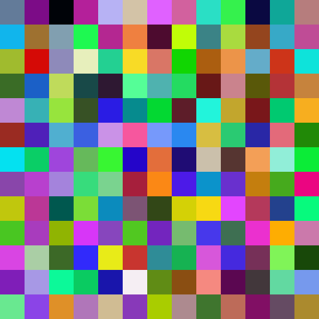

PPPLOP
======

Image Placeholder Generator

The placeholders are aimed to look like the one below
PPPLOP is a novel image placeholder that creates
                               images that are composed of small squares of other 
                               images. I really only made it cos I like all
                               things random.
                               Defaults ;
                               Image size      : 520x520
                               Color Spectrum  : randomized rgb between 255

